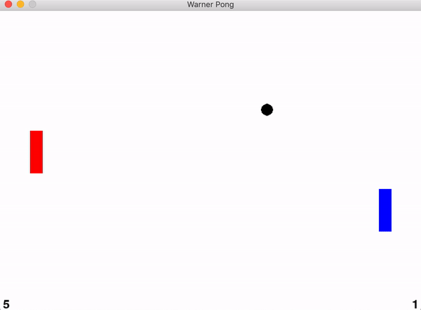

# Warner Pong README

Author: Elisa Warner  
Date:  Dec 23, 2019  
Last Update: Jan 5, 2020   

##Description:
This is a game dedicated to my dad, who once upon a time made a similar "Warner Pong" game in Turbo C (based on the old Pong games). This was an attempt to recreate his work based on my memory of the game, with a new Warner tweak.  

## Sample Game Play
  
_Red is the computer player and blue is the human player._

## Requirements:
This game currently requires Python 3.6 with the following packages:  
* `pygame`  
* `numpy`  

It has been tested 1) on a Mac using Python 3.6 with Anaconda and 2) on a Linux system using Python 3.6 with pygame and numpy packages only. To run, simply type `pythonw pong.py` in the command line.  (Yes, the command is `pythonw` with a `w`)  

**Note: If you don't have the above packages, you may need to install pip (https://pip.pypa.io/en/stable/installing/). Then simply type:  `python -m pip install -r requirements.txt` in your terminal or command window to install the packages needed for this game.**

## How to Play:
Currently, the rules are simple: press the UP and DOWN keys to move. There is a difficult maneuver called a "spike," which occurs when you press LEFT at the same time the ball collides with the paddle. The ball flashes a red color when this happens and then it moves faster.

## Future Plans:
1. Add a title page and effects for spiking
2. Create a Hall of Fame for when the game ends. Define game ending

## Recent Updates:
1. Improved game physics for paddle's collision with ball  
2. Refactored code to make easier to read (rearranged things, changed variable names, moved repetitive sequences to routines, simplified code)  
3. Removed spike bug (now allows spiking for Player 1)  
4. Removed serving bug (ball used to sometimes bounce off back of paddle on serving, doesn't do that anymore)  
