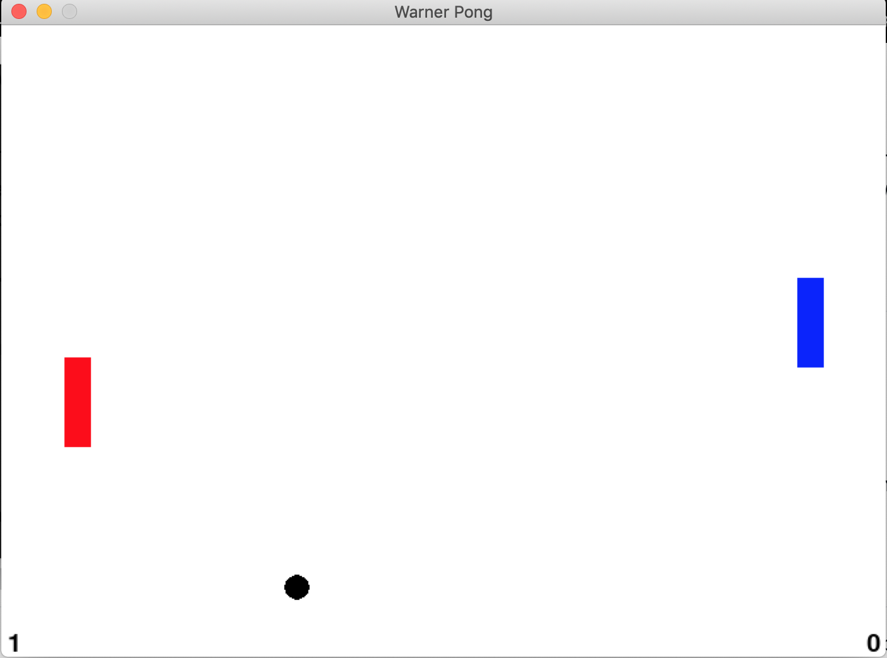

# Warner Pong README

Author: Elisa Warner  
Date:  Dec 23, 2019  

**Description:** This is a game dedicated to my dad, who once upon a time made a similar "Warner Pong" game in Turbo C (based on the old Pong games). This was an attempt to recreate his work based on my memory of the game, with a new Warner tweak.

## Requirements:
This game currently requires Python 3.6 with the following packages:
* pygame
* numpy

It has been tested on a Mac using Python 3.6 with Anaconda. To run, simply type `pythonw pong.py` in the command line.  (Yes, the command is `pythonw` with a `w`)

## How to Play:
Currently, the rules are simple: press the UP and DOWN keys to move. There is a difficult maneuver called a "spike," which occurs when you press LEFT at the same time the ball collides with the paddle. The ball flashes a red color when this happens and then it moves faster.

## Future Plans:
1. Add a title page and effects for spiking
2. Make spiking a little easier to do
3. Create a Hall of Fame for when the game ends. Define game ending